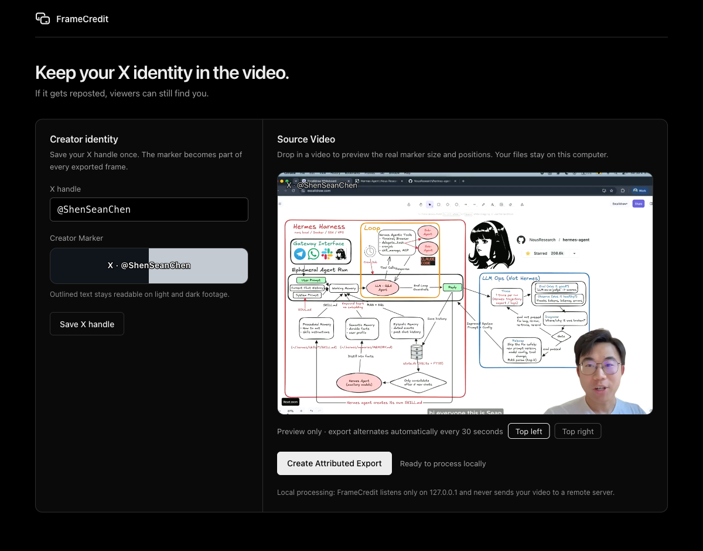

# FrameCredit

**Burn your X handle into every frame of your video before you publish, so reposted copies still credit you.**

[](https://github.com/huaruic/framecredit/actions/workflows/ci.yml)
[](LICENSE)
[](pyproject.toml)

When your video gets downloaded and re-uploaded on X (Twitter), the repost
usually keeps everything except one thing: you. FrameCredit renders a compact,
outlined `X · @yourhandle` Creator Marker into the video pixels themselves.
Unlike metadata or a static logo in one corner, the marker survives
re-encoding and travels with every copy, and it alternates between the two top
corners every 30 seconds so no part of your content is permanently covered.

Everything runs on your own machine. No accounts, no uploads, no cloud.



**[Website](https://huaruic.com/framecredit/)** ·
**[FAQ](https://huaruic.com/framecredit/#faq)** ·
**[Changelog](CHANGELOG.md)** ·
**[简体中文](README.zh-CN.md)**

## Install

FrameCredit needs `ffmpeg`/`ffprobe` on `PATH`. The `uv` route below also
manages Python for you; if you already have Python 3.11+, plain pip works
too.

**macOS**

```bash
brew install uv ffmpeg
uv tool install framecredit
```

**Windows (PowerShell)**

```powershell
winget install astral-sh.uv
winget install --id Gyan.FFmpeg.Essentials -e --source winget
uv tool install framecredit
```

**Debian/Ubuntu**

```bash
sudo apt update && sudo apt install ffmpeg
curl -LsSf https://astral.sh/uv/install.sh | sh
uv tool install framecredit
```

**With an existing Python 3.11+**

```bash
python3 -m pip install framecredit
```

Open a new terminal, then confirm everything is ready:

```bash
framecredit --version && ffmpeg -version && ffprobe -version
```

Upgrade later with `uv tool upgrade framecredit` or
`python3 -m pip install -U framecredit`.

## Quick start

**Command line** - one video in, one Attributed Export out:

```bash
framecredit process input.mp4 --x-handle "@yourhandle" --output attributed.mp4
```

**Local app** - save your handle once, then drag and drop:

```bash
framecredit app
```

The app opens in your browser, previews the real marker on the first frame of
your video, and writes Attributed Exports to `~/Movies/FrameCredit`. It
listens only on `127.0.0.1`; your footage never leaves the machine. Keep the
terminal running while you use it; `Ctrl+C` stops it.

## What you get

- A compact one-line `X · @handle` marker in transparent outlined text,
  readable on both light and dark footage, with no opaque panel behind it.
- Deterministic placement: top-left for 0-30 seconds, top-right for 30-60,
  repeating. Nothing to configure per video.
- Standard output: H.264 video + AAC audio MP4 that keeps the source
  dimensions, audio track, and duration (within 150 milliseconds), ready to
  upload anywhere.
- Guardrails: still images and unreadable files fail with clear messages,
  existing outputs are never silently overwritten, and failed encodes never
  leave partial files behind.

## What FrameCredit does not promise

FrameCredit is honest about its scope: the goal is **Attribution Survival**,
not theft prevention.

- Burned-in pixels cannot be a clickable link or a QR code.
- A determined editor can crop, cover, or paint over any visible marker.
- What it does do: after an ordinary repost (re-encode, light crop, added
  captions), viewers can still read your handle and search for you.

## Contributing

Issues and pull requests welcome - see [CONTRIBUTING.md](CONTRIBUTING.md).
The project vocabulary lives in [CONTEXT.md](CONTEXT.md); architectural
decisions in [docs/adr/](docs/adr/).

## License

[AGPL-3.0-or-later](LICENSE). You can use, modify, and redistribute
FrameCredit freely; if you run a modified version as a network service, you
must offer its source to your users under the same license.
